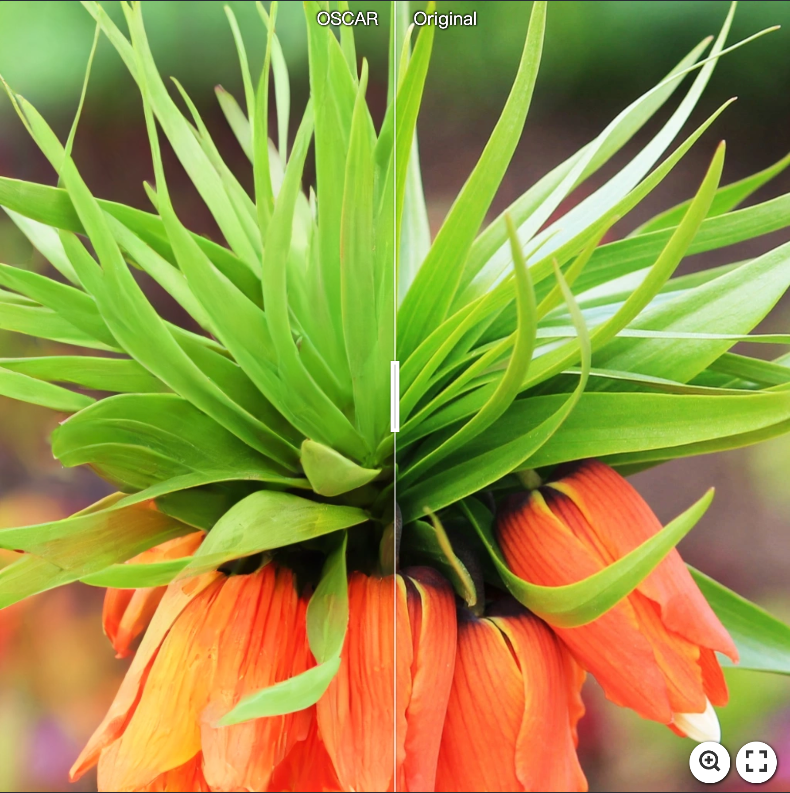
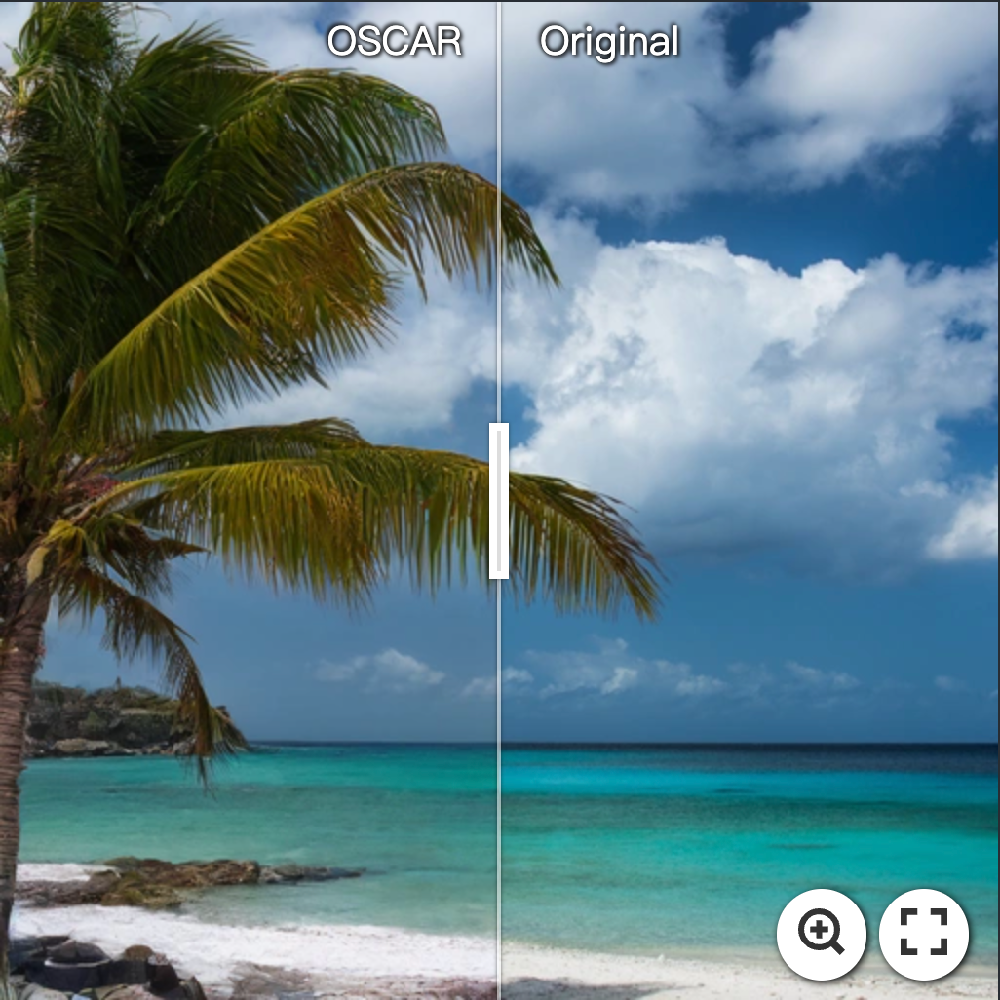
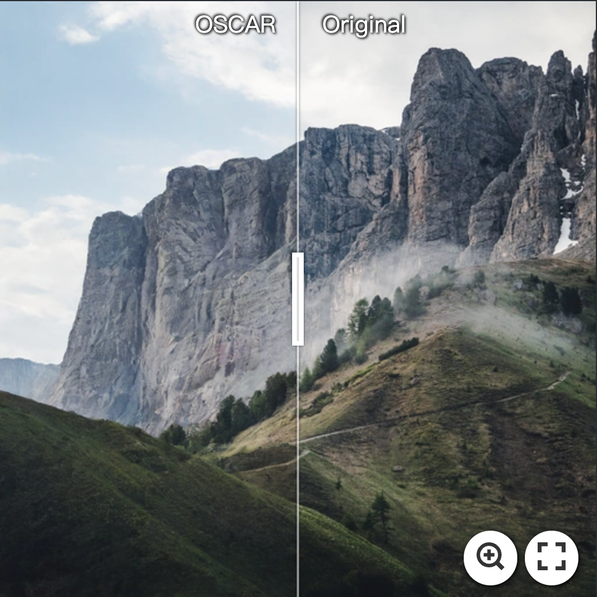
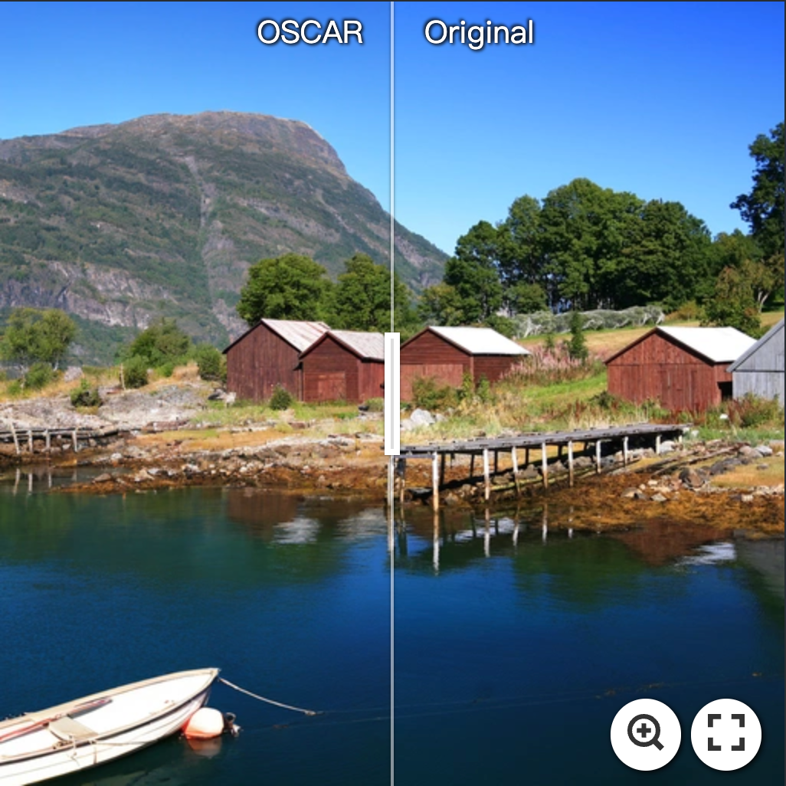
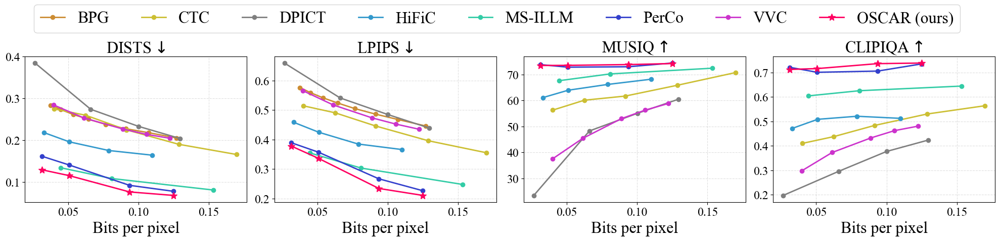
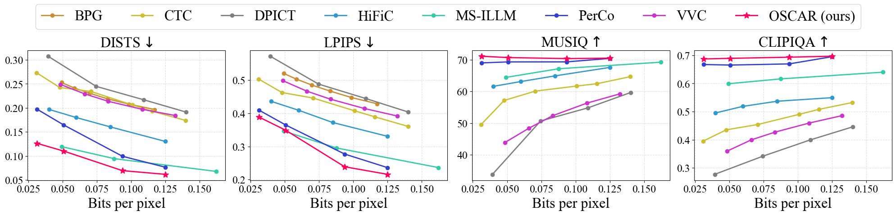
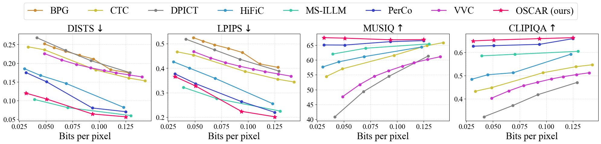
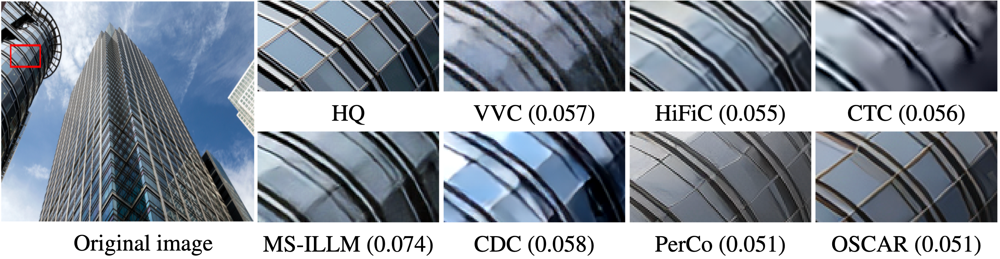
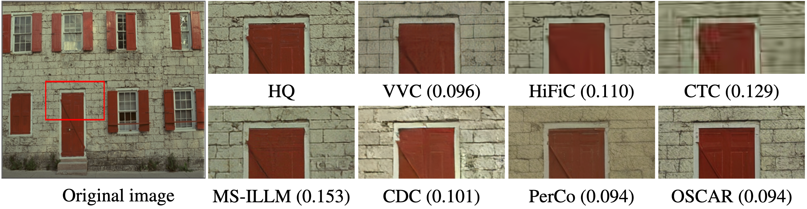

# OSCAR: One-Step Diffusion Codec Across Multiple Bit-rates

[Jinpei Guo](https://jp-guo.github.io/), Yifei Ji, [Zheng Chen](https://zhengchen1999.github.io/), [Kai Liu](https://kai-liu.cn/), [Min Liu](https://minliu01.github.io/), Wang Rao, [Wenbo Li](https://fenglinglwb.github.io/),  [Yong Guo](https://www.guoyongcs.com/), and [Yulun Zhang](http://yulunzhang.com/),  "OSCAR: One-Step Diffusion Codec Across Multiple Bit-rates", arXiv, 2025

[[paper]()] [[supplementary material]()]

#### 🔥🔥🔥 News

- **2025-05-20:** This repo is released.

---

> **Abstract:** Pretrained latent diffusion models have shown strong potential for lossy image compression, owing to their powerful generative priors. Most existing diffusion-based methods reconstruct images by iteratively denoising from random noise, guided by compressed latent representations. While these approaches have achieved high reconstruction quality, their multi-step sampling process incurs substantial computational overhead. Moreover, they typically require training separate models for different compression bit-rates, leading to significant training and storage costs. To address these challenges, we propose a one-step diffusion codec across multiple bit-rates. termed OSCAR. Specifically, our method views compressed latents as noisy variants of the original latents, where the level of distortion depends on the bit-rate. This perspective allows them to be modeled as intermediate states along a diffusion trajectory. By establishing a mapping from the compression bit-rate to a pseudo diffusion timestep, we condition a single generative model to support reconstructions at multiple bit-rates. Meanwhile, we argue that the compressed latents retain rich structural information, thereby making one-step denoising feasible. Thus, OSCAR replaces iterative sampling with a single denoising pass, significantly improving inference efficiency. Extensive experiments demonstrate that OSCAR achieves superior performance in both quantitative and visual quality metrics.


---

<!--  -->

#### OSCAR compression demos with bpp=0.0313

[](https://imgsli.com/MzgxMjg5) [](https://imgsli.com/MzgxMjkw) [](https://imgsli.com/MzgxMjky)

#### OSCAR compression demos with bpp=0.0507

[](https://imgsli.com/MzgxMzE3) [](https://imgsli.com/MzgxMzE5) [](https://imgsli.com/MzgxMzI3)

#### OSCAR compression demos with bpp=0.0937

[](https://imgsli.com/MzgxMzIx) [](https://imgsli.com/MzgxMzIz) [](https://imgsli.com/MzgxMzI0)

---

## ⚒️ TODO

* [ ] Release code and pretrained models

## 🔗 Contents

- [ ] Datasets
- [ ] Models
- [ ] Testing
- [ ] Training
- [x] [Results](#Results)
- [ ] Citation
- [ ] Acknowledgements

## <a name="results"></a>🔎 Results

<details>
<summary>&ensp;Quantitative Comparisons (click to expand) </summary>
<li> Quantitative results on Kodak dataset. 
<p align="center">

</p>
</li>
<li> Quantitative results on DIV2K-val dataset. 
<p align="center">

</p>
</li>
<li> Quantitative results on CLIC2020 dataset. 
<p align="center">

</p>
</li>
</details>
<details open>
<summary>&ensp;Visual Comparisons (click to expand) </summary>
<p align="center">

</p>
<p align="center">

</p>
<p align="center">

</p>
</details>

## <a name="citation"></a>📎 Citation

If you find the code helpful in your research or work, please cite our work.

[//]: # (```)

[//]: # (@article{guo2025compression,)

[//]: # (    title={Compression-Aware One-Step Diffusion Model for JPEG Artifact Removal},)

[//]: # (    author={Guo, Jinpei and Chen, Zheng and Li, Wenbo and Guo, Yong and Zhang, Yulun},)

[//]: # (    journal={arXiv preprint arXiv:2502.09873},)

[//]: # (    year={2025})

[//]: # (})

[//]: # (```)
[TBD]

## <a name="acknowledgements"></a>💡 Acknowledgements

[TBD]

<!--  -->
