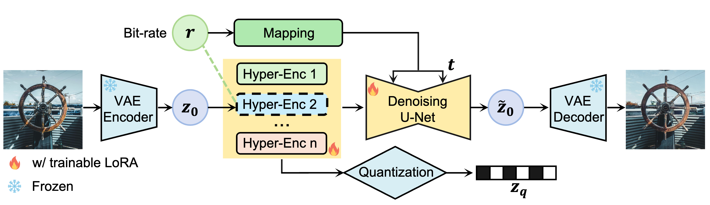

# OSCAR: One-Step Diffusion Codec Across Multiple Bit-rates

[Jinpei Guo](https://jp-guo.github.io/), Yifei Ji, [Zheng Chen](https://zhengchen1999.github.io/), [Kai Liu](https://kai-liu.cn/), [Min Liu](https://minliu01.github.io/), Wang Rao, [Wenbo Li](https://fenglinglwb.github.io/),  [Yong Guo](https://www.guoyongcs.com/), and [Yulun Zhang](http://yulunzhang.com/),  "OSCAR: One-Step Diffusion Codec Across Multiple Bit-rates", NeurIPS, 2025

[[paper](http://arxiv.org/abs/2505.16091)] [[supplementary material](https://github.com/jp-guo/OSCAR/releases/tag/v1)]

#### 🔥🔥🔥 News

- **2025-05-20:** This repo is released.

---

## <a name="setup"></a> Setup
### Environment
```aiignore
conda env create -f environment.yml
conda activate oscar
```

### Models
Please download the following models and place them in the `model_zoo` directory.
1. [SD-2.1](https://huggingface.co/stabilityai/stable-diffusion-2-1)
2. [OSCAR](https://huggingface.co/jinpeig/OSCAR)

> **Abstract:** Pretrained latent diffusion models have shown strong potential for lossy image compression, owing to their powerful generative priors. Most existing diffusion-based methods reconstruct images by iteratively denoising from random noise, guided by compressed latent representations. While these approaches have achieved high reconstruction quality, their multi-step sampling process incurs substantial computational overhead. Moreover, they typically require training separate models for different compression bit-rates, leading to significant training and storage costs. To address these challenges, we propose a **o**ne-**s**tep diffusion **c**odec **a**cross multiple bit-**r**ates. termed OSCAR. Specifically, our method views compressed latents as noisy variants of the original latents, where the level of distortion depends on the bit-rate. This perspective allows them to be modeled as intermediate states along a diffusion trajectory. By establishing a mapping from the compression bit-rate to a pseudo diffusion timestep, we condition a single generative model to support reconstructions at multiple bit-rates. Meanwhile, we argue that the compressed latents retain rich structural information, thereby making one-step denoising feasible. Thus, OSCAR replaces iterative sampling with a single denoising pass, significantly improving inference efficiency. Extensive experiments demonstrate that OSCAR achieves superior performance in both quantitative and visual quality metrics.

---

## <a name="training"></a> Training
Training consists of two stages. In the first stage, we train hyper-encoders. In the second stage, we fine-tune both hyper-encoders and OSCAR's UNet with LoRA.
### First Stage
Update the training [configuration file](https://github.com/jp-guo/OSCAR/tree/main/options/train_hyper_enc.json) and [training script](https://github.com/jp-guo/OSCAR/tree/main/train_hyper_enc.sh) with appropriate values. You should select one `bpp` value from the predefined list in [rate_config.py](https://github.com/jp-guo/OSCAR/tree/main/utils/rate_config.py). Once the configuration is updated, run the training command as follows:
```aiignore
bash train_hyper_enc.sh
```

### Second Stage
Update the [configuration file](https://github.com/jp-guo/OSCAR/tree/main/options/train_diff.json) and [training script](https://github.com/jp-guo/OSCAR/tree/main/train.sh) with appropriate values, specify the hyper-encoder checkpoint from the first stage, 
and launch training:
```aiignore
bash train.sh
```

---

## <a name="Testing"></a> Testing

Specify the paths to the OSCAR checkpoints, as well as the dataset directory in [test.sh](https://github.com/jp-guo/OSCAR/tree/main/test.sh), then run:
```aiignore
bash test.sh
```

---




## <a name="results"></a> Results

<details>
<summary>&ensp;Quantitative Comparisons (click to expand) </summary>
<p align="center">

</p>
</details>
<details open>
<summary>&ensp;Visual Comparisons (click to expand) </summary>
<p align="center">

</p>
</details>

## <a name="citation"></a> Citation

If you find the code helpful in your research or work, please cite our work.

```
@article{guo2025oscar,
    title={OSCAR: One-Step Diffusion Codec Across Multiple Bit-rates},
    author={Guo, Jinpei and Ji, Yifei and Chen, Zheng and Liu, Kai and Liu, Min and Rao, Wang and Li, Wenbo and Guo, Yong and Zhang, Yulun},
    journal={arXiv preprint arXiv:2505.16091},
    year={2025}
}
```

## <a name="acknowledgements"></a> Acknowledgements

This code is built on [PerCo](https://github.com/Nikolai10/PerCo) and [CODiff](https://github.com/jp-guo/CODiff).

<!--  -->
